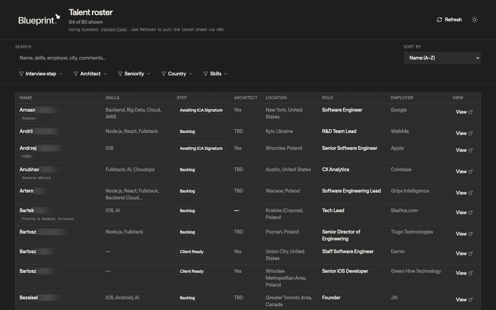
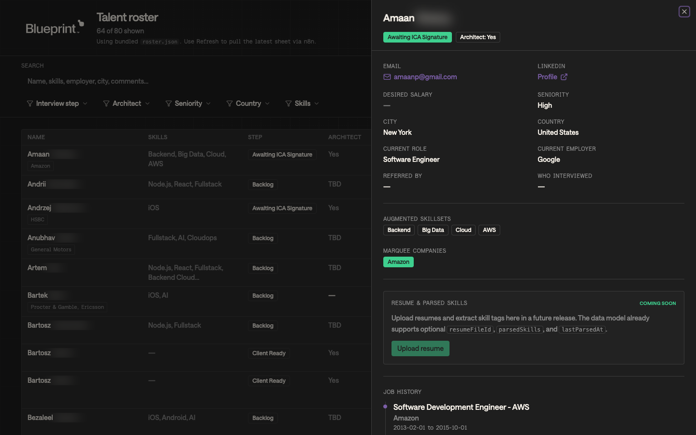

# Blueprint — Talent roster

Internal web app to browse, filter, and sort the contractor talent roster. Data loads from a static JSON file in `public/` (array of row objects keyed by column name).

## Screenshots

**Roster** — filters, sort, and table (dark theme).



**Detail** — row opens a sheet with profile fields and job history.



To regenerate these images after UI changes, install the Playwright browser once (`npx playwright install chromium`), then run `npm run capture:readme`. That build sets `VITE_SCREENGRAB_PRIVACY=true` so **surnames are blurred** in the capture (first name stays readable). Normal `npm run dev` / production builds do not set this.

## Run locally

```bash
npm install
npm run dev
```

Open the URL Vite prints (typically `http://localhost:5173`).

## Update roster data

### Live refresh (n8n)

The header **Refresh** button calls your n8n webhook (default URL in [src/config/rosterWebhook.ts](src/config/rosterWebhook.ts)), stores the response in **localStorage**, and shows **Last updated** with the fetch time. Requests use `cache: no-store` so the browser does not serve a stale response.

Override the URL without editing code:

```bash
# .env.local
VITE_N8N_ROSTER_WEBHOOK=https://your-instance.app.n8n.cloud/webhook/...
```

The webhook should return JSON: a **array of row objects**, a **single row object** (one person), or an object with an array under `data`, `rows`, `roster`, `items`, or `results`. Each row must match the field names in [src/lib/rosterColumns.ts](src/lib/rosterColumns.ts).

### Bundled fallback

If there is **no** cached webhook payload yet, the app loads `public/roster.json` once. Replace that file to ship a default roster with the build.

`Desired Salary` may be a string (`$50.00`) or a number (`50`). **Job History JSON** may be a string of JSON or an already-parsed array.

The **Skills** column, skill filters, and search use **`Augmented Skillsets`** (comma-separated). The legacy **`Skillset(s)`** column is not read by the app.

## Build

```bash
npm run build
npm run preview
```

Static output is in `dist/` — suitable for any static host (S3, Netlify, Vercel, etc.).

## Branding & fonts

Visual design follows Blueprint tokens (dark-first, purple / teal accents, Saans). Saans is loaded from a third-party CDN (`fonts.cdnfonts.com`), same approach as the marketing landing page. Full notes live in [docs/brand-guidelines.md](docs/brand-guidelines.md).

## Future: resumes & parsed skills

The `Talent` type includes optional `resumeFileId`, `parsedSkills`, and `lastParsedAt` for a future upload + extraction flow. The detail panel includes a disabled “Upload resume” stub until that ships.
